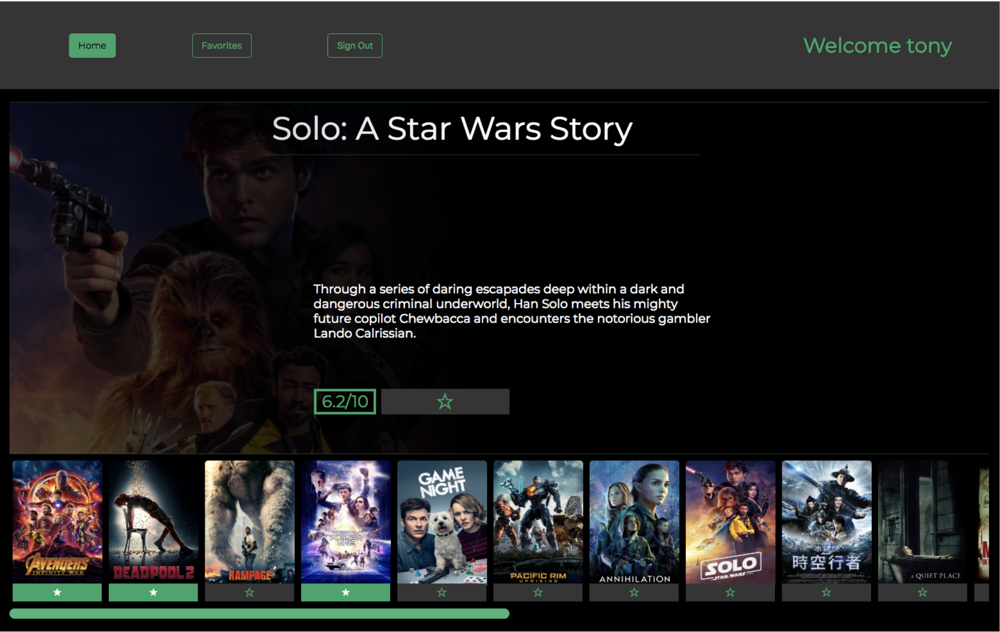

# MOVIE TRACKER

The point of this project was to take use data from a movie API, using React, display the data to the page. We used Jest and Enzyme as test suite for the application. This project was built using the [create-react-app](https://github.com/facebookincubator/create-react-app) boilerplate.

### Project team:

Jack Laird[GitHub](https://github.com/JackLaird0) 
Stephanie Ospina [GitHub](https://github.com/sospinar21) 
Tony Robertson [GitHub](https://github.com/tonyr729) 

### Our design:

## Set Up

* Clone this project

* Run `npm install` from the root directory

* Run `npm start` and visit localhost:3000 in your browser

* Run tests with `npm test`
